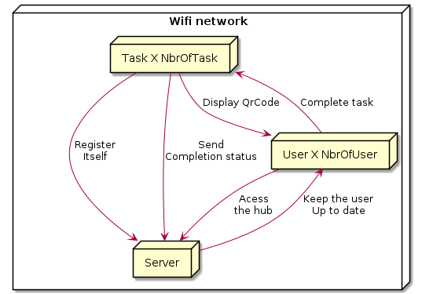
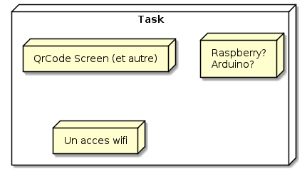

# Among Us IRL analyse

En ten que dev mon objectif principal va être d'analyser une infra possible pour faire fonctionner un among us IRL

## Disclaimer

L'intégralité de ce document est bourré de faute d'orthographe, il est actuellement 2h25 du matin et je me tape une bonne insomnie (Merci mon cerveau qui a décider de réfléchir a l'infra d'un among us irl aussi tard !!) et disons que je ne suis pas le meilleur amis de la langue française

## Communication

Perso en regardant ta vidéo du 3 juin a nouveaux ton idée de carte RFID je suis pas spécialement pour, j'ai une préférence pour un réseau wifi aux quelle tout les utilisateur vont se connecter et accéder a leur hub via leur téléphone.

Une fois l'utilisateur arriver a une tache celui ci n'aura qu'a scanner un QR code et il pourra déverrouiller la progression de la tache + accéder a des indication sur la dite tache via leur hub.

## Server (Le chef d'orchestre)

J'avais imaginer découper ce serveur en 3 aspect (qui ne seront qu'un processus en réalité).

L'objectif serais aussi de faire rentré ce seule processus dans un Raspberry.

### WebStatic /

KESAKO ? Par WebStatic (Contenue Web qui ne change pas) j'entend l'interface du hub. J'imaginais une SPA(Single Page Application) type ReactJS ou VueJs avec un aspect Installable(PWA ou Progressive Web App pour la suite) afin de permettre de rendre plus facile l'accès aux hub (une icône sur l'écran d'accueille qui qui facilitera le retour sur l'application en cas de mauvaise manip)

Pour la partie contenue de l'application web c'est du To do next.

### WebRestApi /api

Comme son nom l'indique une API type Rest qui permettrait aux application ainsi qu'aux tache d'interagir avec le serveur.

J'imaginais sois un serveur NodeJs(Koa/Express) sois C#(Asp.net).

ApiTask: /api/Task

- Les tache devront avant le début de la partie s'enregistrer aux prét du server (automatique ou non)
- Les tache devront répondre la complétion d'une tache ou non

ApiHub: /api/hub

- Le hub permet aux utilisateur de s'enregistrer dans la partie
- Le hub communiquera le profil de l'utilisateur (Status/Tache a accomplir, etc)
- Le hub permettras de demander l'accès a une tache

### WebAsync /async

Et la toute la magie ce situe ici. L'objectif du serveur asynchrone serais de permettre la communication en temps réel avec les hub.

Voici une liste des intérêt:

- Affichage des notification en temps réel (Tache finis,Message de l'admin, etc)
- Avertir les appareille d'un buzzer/un kill report ou de la fin de la partie
- Affichage en temps réelle du nombre de tache résolue
- Possibilité via le QrCode d'un boîtier de rendre les vitals directement sur le hub ?
- Intégrer un tchat interne a la partie ?

Pour l'aspect tech j'imaginais sois un serveur Socket.io ou un serveur SignalR pour c#

## Task (Les instruments)

L'inconvénient de ma solution/mon infra est que chaque tache devra pouvoir communiqué avec le serveur et posséder un écran (petit ou non) qui permettras d'afficher un code QR.

Ici encore le contenue des tache dépendront et reste dans la partie TODO.

Les tache pourrons aussi indiqué a l'utilisateur si celui ci c'est tromper de tache et qu'il ne dois pas la compléter (sauf dans le cas d'un imposteur)

Le serveur devra aussi ping les tache a intervalle régulière (afin de s'assurer que la tache est toujours en ligne (permettrait de prévenir les admin d'un dysfonctionnement))

Les tache pourrait aussi récupérer leur configuration du serveur ainsi que leur codeQR qui serais propre a chaque partie (ou inversement une caméra sur la tache scannerais le Code Qr de l'utilisateur ?)

## Le hub (Les artistes)

Je n'ai pas encore vraiment réfléchis a tout ce que pourrais contenir la partie Hub mais celle ci servira basiquement a tout.

J'imaginais par contre que les kill pourrais être effectuer via le hub (On pourrais détecter les appareille en bluetooth autour de nous et si il sont a x métre mais cella ne me parait pas possible).

Pour les spec du hub par contre :D

- Une interface en reactJs/VusJs (j'ai un légère préférence pour react mais j'apprend vue)
- Socket.io Client ou signalrClient qui permettront le Temps Réel
- Un ServiceWorker qui permettras l'envoie de notification/l'installation de l'application sur l'écran d'accueille ainsi qu'un peu d'offline

Quelque idée en vrac pour le hub:

- Suivie des tache assigner
- Suivie de l'avancement des tache
- Affichage du status de l'user
- Kill Report
- I've Been Killed by Report (ne prévient que le serveur pas les user)
- I've Killed Report (notifie l'user mort lui demandant si il est mort ou non ?)
- Enregistrement de l'user dans la partie
- Notification de Buzzer/Kill Report/Fin de partie via vibration/push notification
- Chat interne a la partie ? Chat avec l'admin ?
- Scan du code QR + avertissement de l'utilisateur si cette tache lui est attribuer
- Check des task attribuer (avec un petite photo de la ou est la tache serais cool)
- Une fois le code Qr scanner instruction pour la tache (remettre la tache en état ou l'effectuer ?)
- Download des donnée pour la task data (fake ou non via nfc ? Bluetooth ? peut être proposer les deux ? ) puis upload de ces data sur une autre borne
