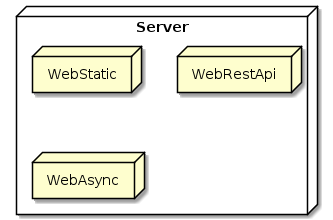

# Among Us IRL analyse

En ten que dev mon objectif principal va être d'analyser une infra possible pour faire fonctionner un among us IRL

## Disclaimer

L'intégralité de ce document est bourré de faute d'orthographe, il est actuellement 2h25 du matin et je me tape une bonne insomnie (Merci mon cerveau qui a décider de réfléchir a l'infra d'un among us irl aussi tard !!) et disons que je ne suis pas le meilleur amis de la langue française

## Communication

Perso en regardant ta vidéo du 3 juin a nouveaux ton idée de carte RFID je suis pas spécialement pour, j'ai une préférence pour un réseau wifi aux quelle tout les utilisateur vont se connecter et accéder a leur hub via leur téléphone.

Une fois l'utilisateur arriver a une tache celui ci n'aura qu'a scanner un QR code et il pourra déverrouiller la progression de la tache + accéder a des indication sur la dite tache via leur hub.

## Server (Le chef d'orchestre)

J'avais imaginer découper ce serveur en 3 aspect (qui ne seront qu'un processus en réalité).

L'objectif serais aussi de faire rentré ce seule processus dans un Raspberry.

### WebStatic

KESAKO ? Par WebStatic (Contenue Web qui ne change pas) j'entend l'interface du hub. J'imaginais une SPA(Single Page Application) type ReactJS ou VueJs avec un aspect Installable(PWA ou Progressive Web App pour la suite) afin de permettre de rendre plus facile l'accès aux hub (une icône sur l'écran d'accueille qui qui facilitera le retour sur l'application en cas de mauvaise manip)

Pour la partie contenue de l'application web c'est du To do next.

### WebRestApi

Comme son nom l'indique une API type Rest qui permettrait aux application ainsi qu'aux tache d'interagir avec le serveur.

J'imaginais sois un serveur NodeJs sois Asp.net.

### WebAsync

Et la toute la magie ce situe ici. L'objectif du serveur asynchrone serais de permettre la communication en temps réel avec les hub.

Voici une liste des intérêt:

- Affichage des notification en temps réel (Tache finis,Message de l'admin, etc)
- Avertir les appareille d'un buzzer/un kill report ou de la fin de la partie
- Affichage en temps réelle du nombre de tache résolue
- Possibilité via le QrCode d'un boîtier de rendre les vitals directement sur le hub ?
- Intégrer un tchat interne a la partie ?
